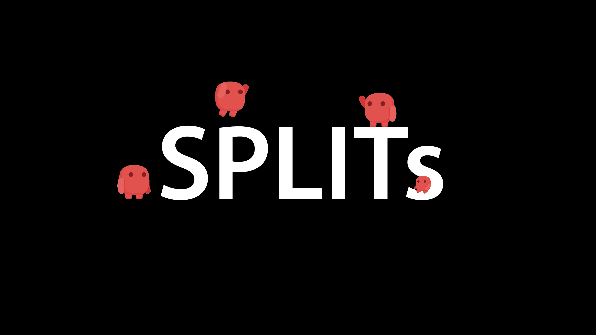

SPLITs
======

</img>

 

**Splits**는 분열한 캐릭터를 동시에 조작하는 Self Co-op 게임입니다. 분열과 합체를 이용한 컨트롤 요소와 퍼즐 요소가 포함되어 있습니다.
  

# 1. 다운로드 및 실행
1. [다운로드 링크](https://docs.google.com/uc?export=download&id=11VRM4sG5Hzn5tLA8ZdN4oIz4ysDD2CYU)에서 실행파일을 다운로드 받습니다.
2. `Splits_exe/Splits.exe` 실행.  

# 2. Tip
- 게임은 자동으로 저장됩니다. **이어하기**를 누르시면 마지막으로 도달했던 스테이지에서 다시 시작합니다.
- 퍼즐을 풀다가 꼬였다면 **R버튼**을 눌러 다시 시작해보세요.
- 해당 게임은 **1920 x 1080** 해상도, **60fps** 제한으로 동작합니다.
- 전체화면이 불편하시다면 **Alt+Enter**로 창모드로 전환하세요.
- **숨겨진 무기**를 찾아보세요!